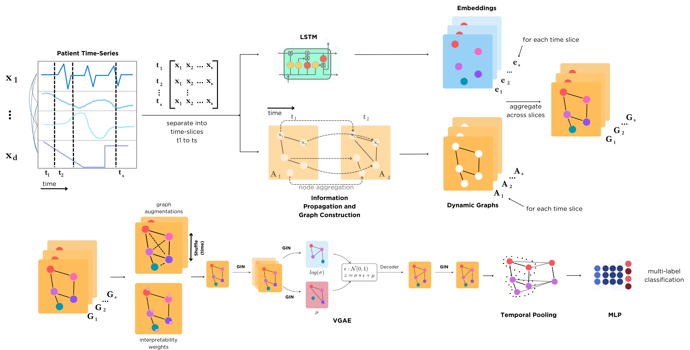

# DynaGraph

This repository is an implementation of DynaGraph: Dynamic Contrastive Graph for Interpretable Multi-label Prediction using Time-Series EHR Data. 

<p align="center">

</p>

## Requirements

To install requirements:

```setup
pip install -r requirements.txt
```
## Training

To train the model(s) in the paper, run the notebook in the Train.ipynb file. You can adjust number of layers, graphs, slices in the model definition. The learning rate and parameters can be adjusted accordingly in the function calls.

## Evaluation

To evaluate the model and retrieve the results for a particular seed, run the Evaluate.ipynb notebook.

The dataset samples are located in the Data folder and are loaded in the notebook accordingly. The ones for MIMIC-III are labeled with an 'X' in the title. The numbers at the end correspond to the respective seeds under which the data splits were generated.

The pre-trained models for the benchmarks as well as for DynaGraph under models. Due to the size limitations, we only include one of the seed runs, but can provide more if requested.

## Results

Our model achieves the following performance on :

### [Image Classification on ImageNet](https://paperswithcode.com/sota/image-classification-on-imagenet)

| Model name         | Top 1 Accuracy  | Top 5 Accuracy |
| ------------------ |---------------- | -------------- |
| My awesome model   |     85%         |      95%       |

>📋  Include a table of results from your paper, and link back to the leaderboard for clarity and context. If your main result is a figure, include that figure and link to the command or notebook to reproduce it. 


## Contributing

>📋  Pick a licence and describe how to contribute to your code repository. 
